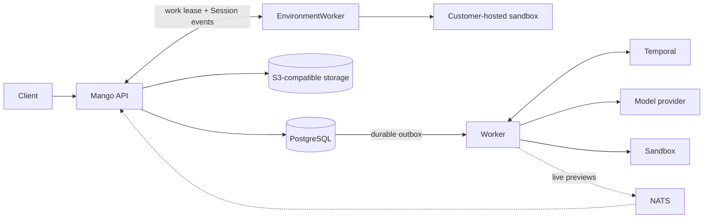

<p align="center">
  <picture>
    <source media="(prefers-color-scheme: dark)" srcset="assets/mango-logo-dark.svg">
    <source media="(prefers-color-scheme: light)" srcset="assets/mango-logo.svg">
    
  </picture>
</p>

<p align="center">
  <strong>The open-source, self-hosted alternative to Claude Managed Agents.</strong>
</p>

<p align="center">
  Run stateful, long-running AI agents on infrastructure you control.
</p>

<p align="center">
  <a href="https://yanpgwang.github.io/mango/">Documentation</a> ·
  <a href="https://yanpgwang.github.io/mango/getting-started">Quick start</a> ·
  <a href="https://yanpgwang.github.io/mango/api">API reference</a> ·
  <a href="https://yanpgwang.github.io/mango/capabilities">Capabilities</a> ·
  <a href="https://yanpgwang.github.io/mango/architecture">Architecture</a>
</p>

<p align="center">
  
  <a href="https://github.com/yanpgwang/mango/actions/workflows/ci.yml"></a>
  <a href="https://github.com/yanpgwang/mango/actions/workflows/pages.yml"></a>
  <a href="LICENSE"></a>
</p>

Mango provides the control plane and execution runtime for autonomous agent
work. Define reusable Agents, run persistent Sessions, stream and steer them
through an event API, and equip them with sandboxed tools, Files, Git
repositories, Skills, Memory, credentials, schedules, and multi-agent
delegation.

## Why Mango

- **Own the whole runtime.** Keep the API, state, orchestration, credentials,
  model traffic, and execution within infrastructure and providers you choose.
- **Keep accepted work durable.** Sessions, events, interrupts, tool calls, and
  client-action waits survive API and worker restarts.
- **Bring your infrastructure.** Choose the model endpoint, object store,
  workers, and sandbox backend without handing the runtime to a hosted agent
  service.

## Quick start

You need Docker with Compose and `make`. No external model credential is
required for the local walkthrough.

```bash
git clone https://github.com/yanpgwang/mango.git
cd mango
export MANGO_API_KEY="${MANGO_API_KEY:-sk-mango-local-development}"
MANGO_MODEL_BASE_URL= MANGO_MODEL_API_KEY= MANGO_MODEL_ID= \
  docker compose -f deployments/local/compose.yaml up -d --build
make local-health
```

Follow the [five-minute walkthrough](https://yanpgwang.github.io/mango/getting-started)
to create an Environment, Agent, and Session, then send and stream your first
message. The command above explicitly selects the deterministic offline model
and supplies a development-only Mango API key unless you override it.

`make local-up` is a convenience command that automatically loads an existing
`~/.config/mango/dev.env`; it may enable a real model. Both paths use the pinned
local OpenSandbox service, whose development runtime creates a separate Docker
container for each Session that needs tools. Mango itself never mounts the
Docker socket. The default sandbox image includes Python and the stack
configures Files storage.

For real model tasks with Files and per-Session OpenSandbox sandboxes, follow
[Use a real model endpoint](docs/getting-started.md#use-a-real-model-endpoint).
The same stack keeps API admission and worker execution configured consistently.

Stop the Compose stack without deleting its data:

```bash
make local-down
```

To explore the Session and multi-agent APIs visually, try the
[terminal UI example](examples/terminal-ui):

```bash
cd examples/terminal-ui
go run ./cmd/mango-tui --demo
```

## What you get

| Area | Included |
| --- | --- |
| Agents and Sessions | Versioned Agent definitions, persistent Sessions, budgets, interrupts, and an event-based HTTP/SSE API |
| Tools and resources | Sandboxed file and shell tools, remote MCP, Files, Git repositories, custom Skills, Memory Stores, and encrypted credentials |
| Durable execution | Persisted event history, journaled tool calls, retries, park/resume, and restart recovery |
| Automation and delegation | Scheduled Deployments, Run history, signed durable Webhooks, persistent child Agents, and Advisor consultations |
| Execution environments | OpenSandbox on Docker for local/CI, a Kubernetes/Kata production-candidate profile, and self-hosted worker leases |
| Operator stack | PostgreSQL-authoritative state, Temporal workflows, S3-compatible objects, and NATS live previews |

> [!IMPORTANT]
> Mango is alpha: its API is unstable and the project does not yet claim
> production readiness. Support varies by workflow and backend; review
> [capabilities and limits](https://yanpgwang.github.io/mango/capabilities)
> before relying on a workflow. The local OpenSandbox Docker runtime shares the
> host kernel; the development stack is not a hardened boundary for hostile
> multi-tenant workloads.

## Relationship to Claude Managed Agents

Mango began with resource and workflow ideas documented by
[Claude Managed Agents](https://platform.claude.com/docs/en/managed-agents/overview).
It addresses the same class of stateful, long-running agent work as an
independent open-source runtime designed for a self-hosted trust boundary.
Mango is not an Anthropic product, does not proxy runtime behavior to a hosted
agent service, and does not promise drop-in SDK or API compatibility. Mango
owns its public API and roadmap; see [Product direction](https://yanpgwang.github.io/mango/product)
for the design policy.

## Architecture



PostgreSQL owns public state, event history, Memory contents and Versions, and
File/Skill lifecycle intents.
An S3-compatible store owns File bytes and immutable Skill archives. Temporal
owns in-flight execution. NATS
carries only ephemeral wakeups and previews; persisted events are always
reconciled from PostgreSQL. A lost signal, process restart, or NATS outage
cannot discard accepted work.

Read the [architecture overview](https://yanpgwang.github.io/mango/architecture)
for the failure model, transactional outbox, tool journal, interrupt ordering,
and sandbox lifecycle.

## Documentation

The [first-party SDKs](sdk/) provide Go, Python, and TypeScript/JavaScript
clients for Mango's current HTTP API. Python and TypeScript use the package name
`mango-sdk`. The SDKs remain alpha; see each package README for installation,
including local source setup. No hosted agent service is required.

| I want to… | Read |
| --- | --- |
| Run my first agent session | [Getting started](https://yanpgwang.github.io/mango/getting-started) |
| Use Go, Python, or TypeScript | [SDK guides and installation](https://yanpgwang.github.io/mango/sdk) |
| Explore Mango in a terminal UI | [Terminal UI example](https://yanpgwang.github.io/mango/examples/terminal-ui) |
| Connect a real model endpoint | [Use a real model endpoint](https://yanpgwang.github.io/mango/getting-started#use-a-real-model-endpoint) |
| Choose an execution backend | [Sandbox backends](https://yanpgwang.github.io/mango/sandboxes) |
| Run a coordinator and child Agents | [Multi-agent guide](https://yanpgwang.github.io/mango/guides/multi-agent) |
| Check an API operation | [API reference](https://yanpgwang.github.io/mango/api) |
| Understand supported behavior | [Capabilities and limits](https://yanpgwang.github.io/mango/capabilities) |
| Plan a deployment | [Deployment model](https://yanpgwang.github.io/mango/deployment) |

The complete documentation is also published at
[yanpgwang.github.io/mango](https://yanpgwang.github.io/mango/).

## Development

```bash
make verify       # lint, unit tests, race tests, and vet
make docs-check   # type-check and build the documentation site
make image-smoke  # build and smoke-test the container image
```

Default tests are offline. PostgreSQL, Temporal, NATS, MinIO, Docker, model,
and remote-sandbox integrations have explicit opt-in suites. See the
[local stack guide](deployments/local/README.md) and
[contribution guide](CONTRIBUTING.md).

Report vulnerabilities privately as described in [SECURITY.md](SECURITY.md).

## License

Mango is licensed under the [Apache License 2.0](LICENSE).
