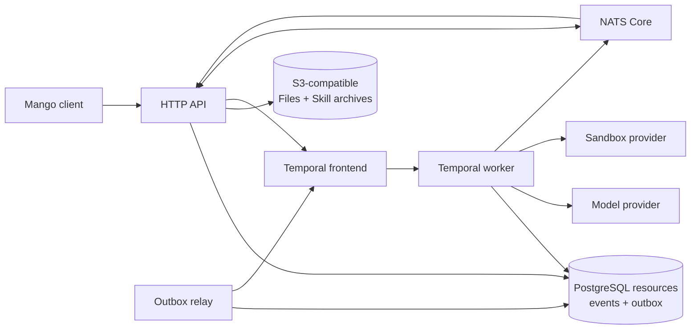

# Architecture overview

`mango` is one codebase with explicit API and worker process roles.
PostgreSQL owns public resources and events, Temporal owns in-flight
orchestration, and NATS Core carries ephemeral wakeups and previews. The local
Compose stack runs those roles separately; they can also be packaged in one
deployment for development.

The selected stack is Temporal orchestration, PostgreSQL, NATS Core,
S3-compatible File and Skill archive storage, and replaceable sandbox providers.
Provider sandbox bindings and File/Skill lifecycle intents are persisted in
PostgreSQL; File bytes and immutable custom Skill archives live in object
storage when those optional surfaces are enabled.

The HTTP edge authenticates opaque API keys into a single Workspace tenant
scope. PostgreSQL roots, asynchronous execution, and object keys preserve that
scope; end-user identity and enterprise RBAC remain outside Mango. See
[Workspace tenancy](architecture/workspace-tenancy.md).

## Design principles

### The server owns history

The event log is the source of truth for public session history. It is not the
lossless provider transcript and must not be used to reconstruct provider-native
context. Every event belongs to exactly one Session Thread. A Session-wide
sequence preserves total order across child activity and explicit primary
cross-posts, while Session history and the primary workflow read only the
primary Thread ledger. Two different public orderings are read from the event
ledger:

- **Public event history** (`GET .../events`, list, and the live SSE stream) is
  the immutable receipt/commit sequence. It never reorders or hides events.
- **Model-facing conversation order** is reconstructed per turn from causality,
  not from raw commit order. PostgreSQL tags committed output with the trigger
  event ID; prior processed triggers are replayed with their exact output before
  the current trigger. A turn never sees a later message queued while it was
  still running.

Each Thread continues model conversations from its own lossless Provider
Transcript. Every transcript row has a database foreign key to its public
trigger event, and Thread ownership is derived from that event rather than
duplicated, so private context cannot drift between Threads. The causal
public-event projection remains only as a legacy fallback for histories
created before transcript support. Compacted Thread projections are preserved as
immutable internal snapshots, and the owning Thread emits the documented
context-compaction event. This separation is required for native server-tool
blocks, citations, compaction, and large results. See
[Storage, context, and connected tools](architecture/storage-context-and-tools.md).
The model endpoint performs inference; it does not own session state.

The sandbox filesystem and attached Session Resources are shared across
Threads, but Agent runtime configuration is not. MCP discovery snapshots are
owned by `(Session, Thread, server name)`, so roster members may use the same
server name with different endpoints or tool surfaces without contaminating
one another. Updating the primary Agent's MCP configuration invalidates only
that Thread's snapshots in the same transaction as the Session projection. A
Session also pins custom Skill Versions for every distinct resolved Agent
execution scope, including its Session-overridden coordinator/self scope.
Threads select only their Agent's discovery metadata and immutable bundle.
Primary/self copies retain `/workspace/skills/<name>/`; external Agents use a
stable namespace below `/workspace/skills/.agents/` so equal runtime names
cannot overwrite one another in the shared filesystem.

### Wire and domain models are separate

`internal/httpapi` owns request decoding and response encoding.
`internal/domain` models persisted resources and execution facts. Mapping is
explicit in both directions so internal sequence numbers, run states, and
storage details cannot leak into the public wire API.

### Public history and execution bookkeeping are different things

Session events are the public append-only history. Temporal Workflow history,
turn attempts, and tool steps are private execution facts. Keeping those models
separate lets orchestration recover without leaking Temporal or retry details
onto the public API.

### Interfaces sit at expensive boundaries

The model client, agent runtime, and sandbox provider are interfaces because
they cross process, trust, or infrastructure boundaries. Domain entities stay
concrete. This keeps the code easy to follow without locking the project to one
model vendor, sandbox backend, or worker topology.

## Package boundaries

| Package | Responsibility |
| --- | --- |
| `cmd/mango` | Composition root, configuration, process lifecycle |
| `internal/httpapi` | HTTP routes, transport validation, DTO mapping, SSE |
| `internal/app` | Shared resource validation and transport-neutral use-case types |
| `internal/blob` | S3-compatible storage for public File bytes and immutable Skill archives |
| `internal/controlplane` | PostgreSQL-backed public Session/Event use cases |
| `internal/domain` | Resource, event, message, tool, and run semantics |
| `internal/pg` | PostgreSQL repositories, ledger, outbox, and tool journal |
| `internal/temporal` | Session Workflow, Activities, worker, and relay |
| `internal/live` | NATS wakeups/previews plus PostgreSQL cursor reconciliation |
| `internal/agentruntime` | Reusable model, message, and tool execution primitives |
| `internal/model` | Offline and Messages API model clients |
| `internal/sandbox` | Provider registry, lifecycle contract, Docker and remote adapters |

The dependency direction points inward: transport and infrastructure depend on
application/domain semantics, while the domain has no HTTP, SQL, model-client,
or sandbox dependencies.

## Durable write path

Submitting input is not “write an event, then call Temporal.” PostgreSQL commits
the client events, status projections, and a coalescible owner-Workflow wakeup
in one transaction. Primary work uses the legacy Session outbox; each child
Thread uses a `(Session, Thread)` outbox and stable Workflow identity. A crash
therefore cannot leave accepted input without a durable path to orchestration.
The relay is the correctness path.

Model and tool calls happen as Temporal Activities outside SQL transactions.
Before each provider call, PostgreSQL durably appends its model-request start;
completed intermediate model/tool rounds are appended idempotently before a
later provider call can start. Turn completion atomically commits the remaining
output, owning Thread provider transcript and usage, trigger `processed_at`,
Thread status, aggregate Session status/usage, and optional attempt
finalization. A child report is appended to the primary ledger and wakes a
later coordinator turn in that same transaction. PostgreSQL emits best-effort
NATS wakeups after each commit; SSE subscribers read the selected Thread's
committed rows by sequence.

Physical session deletion is a small saga: PostgreSQL first marks the row as
deleting under the admission lock, the API terminates its Session Workflow, a
short Temporal Workflow durably releases the provider sandbox and binding, and
only then does PostgreSQL remove the projection. The binding foreign key blocks
deletion from discarding the last reference to a live sandbox. Workers scan the
durable deletion fence and resume this sequence if the API process exits before
cleanup or finalization completes.

Live text deltas are the exception: they are explicitly ephemeral previews,
delivered only to opted-in SSE subscribers. They are never returned by event
history.

## Scaling boundaries

API replicas are stateless around PostgreSQL and NATS. Temporal assigns Workflow
and Activity tasks to workers; the PostgreSQL tool journal records the
side-effect ambiguity boundary. Core NATS is at-most-once, so streams
periodically reconcile their durable cursor and never treat a wakeup as data.
Worker Versioning and promotion of remote sandbox adapters through repeatable
live conformance are still required before production rolling deployments.

Workflow changes use Temporal version markers where replay safety
requires them, and `internal/temporal` carries an offline `worker.WorkflowReplayer`
harness that replays synthetic pre-change histories against the current code.
The harness covers every recorded prefix of the ordered turn-level version
gates and both sides of the Session Workflow durable-interrupt gate. A version
marker is scoped to one Workflow execution, so it can only keep a code branch
consistent inside that execution. `SessionWorkflow` continues-as-new and
PostgreSQL outlives every execution, so any semantic that must agree with
already-published events — such as which tool-result variant answers a parked
tool call — is derived from the durable event rather than from a version gate.
Production rolling deployments still need Worker Versioning.

## Current implementation boundaries

The strongest current risks are semantic rather than structural:

1. Model requests are bounded by a conservative server-owned token estimate and
   extractive compaction policy. Provider-exact tokenizers, per-model context
   profiles, and complete per-provider-request audit snapshots are not yet
   implemented. Compacted message projections are durably checkpointed per Thread.
2. Sandboxes are session-scoped and durably bound to opaque provider IDs.
   Restart reattachment and deletion cleanup are implemented for local and
   Docker on the same host/daemon. Provisioning intent closes the
   create-before-binding crash window and workers autonomously resume fenced
   deletions. Provider-aware routing for heterogeneous workers, quotas, and
   eviction are not implemented.
3. Worker Versioning, observability, enterprise identity/RBAC, large-payload
   offload, and production manifests remain open. The OSS Workspace API-key
   and tenant-isolation boundary is implemented.
4. Provider Transcript, native Web Search/Fetch, sandbox result
   materialization, and unauthenticated MCP tools are implemented. Context
   Snapshots, provider-round records, deployment-managed MCP authentication, and
   reference-only Temporal payloads remain open.
5. Ordinary coordinator delegation, persistent child execution, cross-posted
   pending-action response routing, targeted/global multi-Thread interrupts,
   and child Workflow shutdown are wired. Archive atomically upgrades the
   child's coalesced orchestration row from wake to terminate; termination
   dominates stale wake delivery. Session deletion enumerates and stops every
   child before primary Workflow and sandbox cleanup.

Current API support is tracked in [capabilities and limits](capabilities.md).
[Product direction](product.md) defines how Mango selects work. Focused changes
may be tracked directly in pull requests; Issues remain available when work
needs discussion, sequencing, or longer-term coordination.
