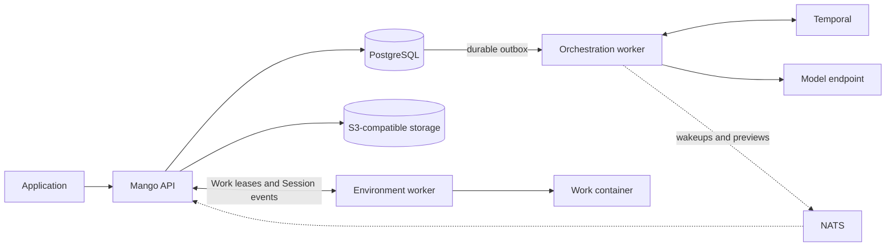

# Architecture

Mango separates its HTTP API, durable orchestration, and tool execution. This
lets applications reconnect independently of running work and lets operators
choose where shell and file tools execute.

For the user-facing resource model, start with [Core concepts](concepts.md).
For configuration, use [Deployment](deployment.md).

## Process topology

This diagram shows the default self-hosted execution path. The orchestration
worker calls the model and coordinates the agent loop. The Environment worker
claims leased activations over HTTP and executes shell/file tools in its own
sandbox. Provider-native Web tools and remote MCP have separate owners; see
[where tools run](concepts.md#where-tools-run).

## State ownership

| System | Owns |
| --- | --- |
| PostgreSQL | Public resources, immutable Events, private model transcripts, Memory Versions, Work leases, outboxes, and execution journals. |
| Temporal | Session and Thread orchestration, durable waits, retries, and Activity scheduling. |
| S3-compatible storage | File bytes and immutable Skill archives; PostgreSQL tracks their lifecycle. |
| NATS Core | Best-effort event wakeups and optional live text previews. |
| Operator sandbox | Tool processes and workspace files; the Docker launcher retains a named workspace volume per Session. |

NATS is not a durable queue for accepted input. Consumers repair missed wakeups
from PostgreSQL cursors. Public Event history is also distinct from a Thread's
lossless model transcript: native tool blocks and other private inference
context must survive without becoming public API fields.

## Durable write path

1. The API validates input and its Workspace scope. PostgreSQL commits Events,
   Session projections, and an outbox wakeup together. Self-hosted activation
   creates or coalesces Environment Work in that transaction.
2. A relay delivers the wakeup to the owning Temporal Workflow. A process crash
   after commit leaves the outbox available for another attempt.
3. The orchestration worker calls the model outside database transactions.
   Completed model/tool rounds are recorded before later rounds begin.
4. Shell/file requests in a self-hosted Session wait for an external result.
   A worker claims Work, renews its lease, runs the tool, and submits a correlated
   result. Expiry or reclaim fences the former worker's credentials and writes.
5. Turn completion commits output, transcript, usage, processed input, and
   Session/Thread state together. Subscribers receive committed Events through
   SSE; NATS only accelerates notification.

Durable orchestration does not make an arbitrary external side effect exactly
once. Journals, correlated results, and idempotency checks define what can be
recovered safely after an ambiguous failure. See
[Session lifecycle](architecture/session-lifecycle.md) and
[Environment Work](api/environment-work.md).

## Threads and shared resources

Every Session has a primary Thread; delegated Threads own separate transcripts,
Events, and execution state. They share the Session budget and workspace.
Agent definitions and Skill Versions are pinned for the Session, and MCP
discovery is scoped by Session, Thread, and server name.

Archive, interrupt, and delete are different lifecycle operations. Session
removal fences admission and coordinates execution cleanup; it does not imply
that every operator-owned workspace volume has been erased. See
[Sessions](api/sessions.md) and the [Docker worker guide](guides/self-hosted-worker.md#stop-the-worker).

## Package boundaries

| Package | Responsibility |
| --- | --- |
| `cmd/mango`, `cmd/mango-worker` | Process composition and configuration. |
| `internal/httpapi` | HTTP routes, wire types, authentication, and SSE. |
| `internal/app`, `internal/controlplane` | Resource validation and public use cases. |
| `internal/domain` | Resource and execution semantics. |
| `internal/pg` | Persistence, event ledger, leases, outboxes, and journals. |
| `internal/temporal` | Workflows, Activities, orchestration workers, and relays. |
| `internal/model`, `internal/agentruntime` | Model transport and conversation/tool-loop primitives. |
| `internal/selfhosted` | Docker launcher and isolated Work execution. |
| `internal/blob`, `internal/live` | Object storage and live transport. |

Public wire types stay at the HTTP boundary. Storage and execution facts remain
internal, and expensive external calls happen outside SQL transactions.

## Further reading

- [Domain model](architecture/domain-model.md): resources and their relationships.
- [Session lifecycle](architecture/session-lifecycle.md): ordering, recovery, and cleanup.
- [Runtime and sandbox](architecture/runtime-and-sandbox.md): conversation and execution boundaries.
- [Self-hosted workers](architecture/self-hosted-workers.md): Work ownership and launcher design.
- [Storage and context](architecture/storage-context-and-tools.md): model transcripts, context preparation, and connected tools.
- [Workspace tenancy](architecture/workspace-tenancy.md): authentication and tenant isolation.

For current support rather than design intent, use [Capabilities and limits](capabilities.md).
Production Worker Versioning, heterogeneous-worker routing, and broader rollout
and reconciliation guarantees remain unfinished.
