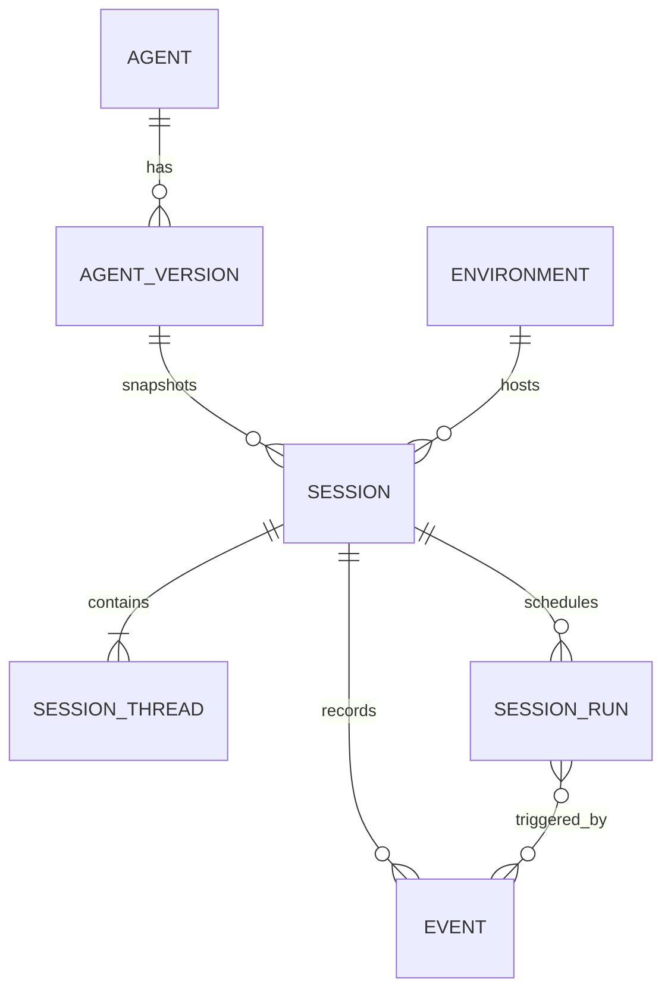

# Domain model

The public API is resource-oriented, while execution uses an additional
internal run model. That distinction is central to the architecture.



## Agent and agent version

An agent defines model configuration, system prompt, tools, MCP server
references, skills, metadata, and optional multiagent configuration.

A multiagent coordinator Version owns a resolved roster of concrete Agent
Version references. Resolution happens when the coordinator is created or
updated; runtime Session creation never follows `latest` again. A `self` entry
is represented by a concrete reference to the same coordinator Version. This
keeps the roster part of the immutable Agent snapshot rather than introducing
a mutable runtime lookup.

The logical identity is the agent `id`; each material update produces a new
integer `version`. A conditional update may send the expected `version` to
detect concurrent changes. Archiving is idempotent, creates no new version, and
makes the agent read-only.

## Environment

An environment is a named self-hosted execution queue selected when creating a
session. Built-in shell/file calls cross a durable Work barrier and resume from
the operator worker's correlated `user.tool_result`.

An environment cannot be deleted while a session references it. Archiving
prevents it from being selected by new sessions without invalidating existing
references.

## Session

A session is the long-lived public container for conversation and execution
state. At creation, it resolves:

1. the latest or explicitly pinned agent version;
2. optional session-local overrides;
3. the selected environment.

The resulting agent snapshot is stored with the session. Later agent updates or
archival cannot mutate it.

The public session status is a projection:

- `idle` — waiting for input or a required client action;
- `running` — accepted work is executing or queued;
- `rescheduling` — an active model request is waiting for its next bounded
  provider retry;
- `terminated` — terminal failure or completion.

Temporal may retry infrastructure-failed Activities internally without changing
the public status. Retryable provider responses instead use the public
`running -> rescheduling -> running` lifecycle. Exhausting that bounded budget
returns the Session to `idle`; permanent failures project to `terminated`.

## Session Thread

A Session is the aggregate container; each Session Thread owns an independent
execution projection containing its resolved Agent snapshot, status, usage, and
timing. The primary Thread has no parent. A child Thread identifies its parent
within the same Session and owns a separate provider context, event view,
retry lifecycle, and pending-action barrier.

The runtime writes primary execution changes to the primary Thread and Session
aggregate in one PostgreSQL transaction. Child execution updates the owning
child projection first and recomputes Session status and usage in the same
transaction. Session-only metadata and resource changes do not mutate a Thread.

Events carry an owning Thread ID in the Session-wide sequence space. A child
ledger retains its canonical model/tool events; selected lifecycle, message,
report, and client-action events are projected separately onto the primary
view. Cross-posted client actions use distinct public IDs so client responses
can be routed back to the canonical child barrier without confusing the two
conversation histories.

## Event

Events are the public, append-only session history. On the wire each event is a
flat tagged union:

```json
{
  "id": "sevt_...",
  "type": "user.message",
  "content": [{"type": "text", "text": "hello"}],
  "processed_at": null
}
```

Internally, each event also has a session-local sequence number used for stable
ordering and cursors. That sequence is never exposed.

Client input, agent output, status changes, errors, and session updates all use
the same log. This gives clients one replayable history rather than separate
message, tool-call, and execution-status stores.

## Workflow turn

A Workflow turn is internal execution bookkeeping, not a public Mango resource.
PostgreSQL records the trigger and committed output; Temporal records the
durable orchestration history and Activity results.

```text
admitted → executing → completed
                     ↘ failed
```

The admission outbox lets accepted input survive API, relay, and worker
restarts. Temporal resumes the Workflow from recorded Activity results.
PostgreSQL turn attempts and tool steps journal the external-side-effect
ambiguity boundary.

## Why events are not runs

Events describe observable session history; Workflow and Activity attempts
describe how the server tries to produce that history. Retries therefore remain
private and do not become public API events.
