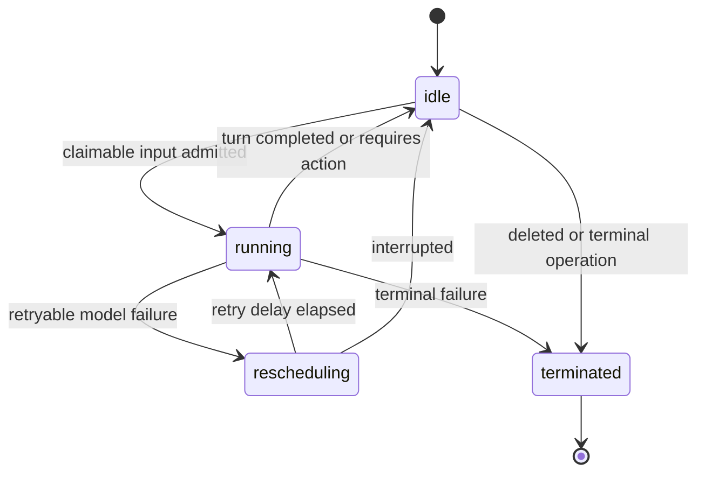

# Session lifecycle

A Session is a durable conversation and execution boundary. PostgreSQL owns its
public state and event history. The primary Thread runs through the Session
Workflow, and each child Thread owns an independent Temporal Workflow. Work is
serialized within a Thread, while independent Threads may execute concurrently
against the Session's shared sandbox.

## Public states

- `idle` means the Session is waiting for ordinary input or a required client
  action.
- `running` means accepted, claimable work is queued or executing.
- `rescheduling` means an immutable model request is waiting for its next
  bounded provider retry. Later input remains queued behind the active turn.
- `terminated` is final.

The status is a projection of committed events. It is not derived from worker
memory or a Temporal query.

## Admission

The API commits client input, its session-local receipt sequence, any required
status transition, and a coalescible orchestration outbox wakeup in one
PostgreSQL transaction. A direct Temporal signal is a latency optimization; the
outbox relay is the recovery path.

Accepted input therefore survives an API or worker crash. NATS is never used as
an execution queue.

## Turn execution

The primary Workflow ID is derived from the Session ID; each child Workflow ID
is derived from its Thread ID. Each Workflow:

1. loads the next claimable trigger from PostgreSQL;
2. reconstructs model-facing history from committed causal history;
3. calls the model and tools through Temporal Activities;
4. commits authoritative output, trigger processing, attempt finalization, and
   the final Session state in one PostgreSQL transaction;
5. advances to the next trigger only after that commit.

Different Sessions and different Threads within one Session can execute
concurrently. Work within an individual Thread remains serialized. Provider
resource locks allow ordinary tool operations to share the Session sandbox,
while a complete Memory snapshot, PostgreSQL sync, and filesystem refresh runs
exclusively between active tool waves.

## Event order and conversation order

The event ledger has two consumers with different ordering needs:

- The public API and SSE stream expose immutable receipt order.
- Model requests use causal conversation order: each processed user trigger is
  followed by the output committed for that turn before a later trigger is
  projected.

This prevents a message admitted during an active turn from appearing in the
model conversation before the reply to the earlier message.

## Tool loop

The Workflow invokes one Activity per model call and built-in tool call.
Completed Activity results are recorded in Temporal history. PostgreSQL also
journals tool steps across `prepared`, `started`, and `completed` so recovery
does not silently repeat a side effect whose result was lost.

A recovered `started` step without a durable result is classified as ambiguous
and refused. Exactly-once execution still requires idempotency from the
side-effecting system.

## Required client actions

A custom tool call or an `always_ask` built-in can end a turn with
`session.status_idle` and `stop_reason.type=requires_action`. The stop reason
contains the action event IDs the client must answer.

PostgreSQL persists those blockers in the same transaction as the action events
and idle status. While any blocker remains unresolved:

- ordinary input is accepted and ordered but is not claimable;
- the Session remains `idle`;
- ordinary input does not enqueue an orchestration wakeup;
- only a matching `user.custom_tool_result` or
  `user.tool_confirmation` can claim the blocker;
- partial results leave the Session idle and do not wake orchestration;
- the final result transitions the Session to running and wakes orchestration;
- resume completion resolves the complete barrier atomically before ordinary
  queued work can continue.

The Workflow selector reads this barrier through an Activity before
ordinary receipt-order work. Once fully claimed, it reconstructs the original
parked tool-use round and all client results, resumes the model loop, and leaves
the receipt cursor behind any lower-sequence ordinary messages admitted during
the wait. A resumed model turn may atomically replace the old barrier with a new
one.

## Interrupts

`user.interrupt` is a durable control event, not a process-local cancel flag.
Admission always writes the PostgreSQL outbox wakeup, including while the
Session is parked on required client actions. The Workflow treats the Temporal
Signal as metadata and rereads PostgreSQL before canceling an Activity.

Model and tool Activities heartbeat so Temporal can deliver cancellation.
PostgreSQL session-row locking defines the finish race for both the primary and
every child Thread:

- if interrupt admission commits before turn completion, the interrupt wins;
- if turn completion commits first, the later interrupt is an idle no-op;
- an interrupted turn publishes exactly one idle `end_turn`;
- completed text and tool-result pairs may be retained, but unstarted tool
  calls and competing error, terminated, and `requires_action` terminals are
  removed;
- a started tool step without a durable result is recorded as ambiguous and is
  never silently retried;
- a message batched after the interrupt starts only after the idle boundary.

An interrupt received while a client-action barrier is parked is acknowledged
without opening or resolving that barrier. An omitted `session_thread_id`
creates independently processable receipts in every active Thread ledger; a
present ID routes only to that Thread. The caller-visible response still echoes
one event per submitted input rather than exposing the internal fan-out copies.

## Failure and delivery semantics

- Permanent model failures commit `session.error` with `retry_status: terminal`
  and `session.status_terminated`.
- Retryable provider responses publish `session.error` with
  `retry_status: retrying`, atomically move through
  `session.status_rescheduled`, and publish `session.status_running` before the
  next attempt. Exhaustion returns the Session to idle with
  `stop_reason: retries_exhausted` and flushes later queued messages.
- Infrastructure failures remain Activity failures so Temporal can recover
  without spending the public provider retry budget.
- Authoritative output is visible only after the PostgreSQL completion
  transaction commits.
- NATS previews and wakeups are best-effort. Clients recover complete events
  from the PostgreSQL-backed event cursor.
- Activity retries for infrastructure recovery remain private. Workflow-owned
  provider retries use deterministic event IDs and never create duplicates.

## Session deletion

Deletion first fences the Session against new admission, terminates its
long-lived Workflow, and starts a short Temporal cleanup Workflow on the
execution worker. Cleanup destroys the provider resource and removes its
persisted binding before the Session projection can be deleted. Repeating the
operation safely joins or repeats idempotent cleanup.

Workers reattach through the same OpenSandbox control plane and its durable
state. Cross-host workers therefore share that service rather than a host-local
runtime reference.
