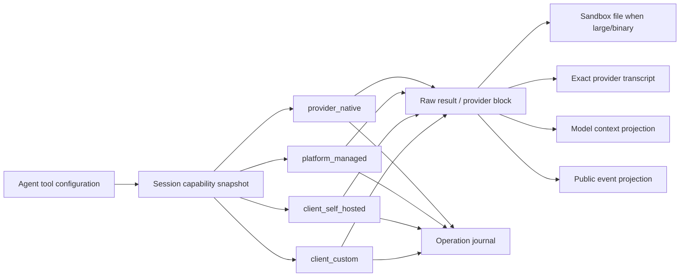

# Storage, context, and connected tools

Status: initial implementation plus follow-up boundaries, 2026-07-31.

This decision originally used the public Claude Managed Agents API as one design
reference. Mango now owns its public contract; the storage and execution
boundaries below remain because they serve durable, observable, self-hosted
agent work. The decision covers Session context, large tool results, Web
Search, Web Fetch, MCP, sandboxes, and Temporal.

The central decision is:

> Web Search, Web Fetch, and MCP are tools at the public API and policy layers.
> Their execution owner is an internal capability selected and pinned for each
> session.

The first implementation may require the configured Messages API `base_url` to
support native Web Search and Web Fetch. The public Agent schema does not gain a
separate search API key or vendor-specific search configuration. The internal
executor boundary remains in place so a platform-managed search/fetch backend
can be added later without changing the public API or stored session semantics.

## Runtime requirements

Mango keeps these runtime requirements:

- A Session is stateful. Its event history and model context survive individual
  runs, while each Session has an isolated sandbox.
- Agents, Environments, Files, Memory Stores, and Sessions have
  independent lifecycles. Deleting a Session must not implicitly delete those
  reusable resources.
- Built-in agent tools include `web_search` and `web_fetch`. MCP tools use the
  same permission-policy concepts as built-ins.
- Agent definitions identify MCP servers and enabled toolsets without embedding
  secrets. Provider and connector credentials belong to deployment/worker
  configuration, not Agent or Session resources.
- MCP tools default to `always_ask`; built-in tools default to `always_allow`.
  A running Session keeps the tool configuration snapshot with which it began.
- Large tool output is materialized as a file in the Session sandbox. The model
  receives a bounded preview and a path rather than an unbounded inline value.
- Self-hosted sandboxes change the execution location, not the control-plane
  resource model. Tool inputs and results still cross the control plane.

The raw Messages API adds one requirement that the public event model alone
cannot satisfy: native server-tool blocks can contain opaque continuation data,
including Web Search encrypted content and citation indexes. Those blocks must
be returned to the provider exactly on subsequent calls.

## Authority model

There is no single representation that is correct for clients, the model,
recovery, and raw bytes. The platform therefore keeps separate logical
authorities:

| Question | Authority | Initial physical store |
| --- | --- | --- |
| What did the client observe? | Public Event Ledger | PostgreSQL |
| What exact context continues the model conversation? | Provider Transcript | PostgreSQL JSONB |
| Did a tool possibly change the world? | Operation Journal | PostgreSQL |
| Where are large tool bytes, mutable files, and processes? | Session Sandbox | Sandbox provider |
| Where are independent public File bytes? | Files API | S3-compatible object storage |
| What knowledge is shared across Sessions? | Memory Store | Separate versioned resource |
| Where are credentials? | Deployment/worker configuration | Environment or operator-managed secret injection |
| What should execute next? | Temporal Workflow state | IDs and small control projections only |

These are logical boundaries, not a requirement for separate services.
PostgreSQL initially holds small transactional records and the lossless
provider transcript. Large tool output and binary MCP content live in the
Session sandbox. There is intentionally no general Artifact subsystem in the
first implementation. Independent public Files use a narrow S3-compatible byte
store without changing the existing tool-result and provider-transcript paths.

### Public Event Ledger

The event ledger is the external API truth:

- append-only receipt and commit order;
- the source for event list, replay, and SSE reconciliation;
- stable public event IDs and public tool-use correlations;
- no provider-private blocks, credentials, or unbounded raw output.

It is **not** the authority for the next model request. Public events are a
projection designed for clients and observation. Reconstructing provider
context from them loses provider-native blocks, citations, encrypted
continuation data, non-text content, and context-compaction decisions.

### Provider Transcript

The Provider Transcript is the lossless model-continuation truth:

- stores the exact ordered content blocks accepted from or sent to a provider;
- preserves provider tool-use IDs rather than replacing them with public event
  IDs;
- preserves unknown provider fields so a client upgrade is not required merely
  to round-trip a new block;
- records provider, model, server-tool version, and capability-profile version;
- is append-only within an execution attempt.

Blocks are initially stored as JSONB. Hydration must reproduce the provider
wire value exactly; a preview or public event payload cannot substitute for it.
If provider transcripts later exceed practical PostgreSQL limits, their
physical blob storage can change behind the transcript boundary without
introducing a public Artifact resource.

A separate mapping relates provider IDs to public IDs:

```text
provider tool-use id <-> internal tool step id <-> public event id
```

The mapping preserves stable public correlations without mutating the provider
transcript.

### Context admission and accounting

Every working-model request passes through the same proactive and predictive
admission policy before provider execution. The policy resolves known Anthropic
model windows from the embedded Catwalk catalog, falls back conservatively for
unknown or ambiguous model IDs, reserves the requested output and one
model/tool growth round, and compacts before the provider's input limit. A
provider `request_too_large` response triggers one more aggressive compaction
attempt for the working turn.

The latest safe provider-usage anchor measures the already-observed request and
response prefix. Request and prefix fingerprints invalidate stale anchors, and
only messages appended after a valid anchor are estimated. Without a safe
anchor, the complete system prompt, messages, and tool schemas use the
provider-independent conservative estimator. Outcome and Advisor calls have
independent preflight admission, but do not yet share the working turn's
provider-overflow recovery path.

### Context Snapshot

A Context Snapshot is an immutable recipe for one provider request. It pins:

- the ordered transcript entry IDs included in the request;
- system instructions and effective Agent/Environment revision;
- resolved tool schemas, permission policy, and execution capability profile;
- model parameters and provider adapter version;
- context-policy version and any summary/compaction entry;
- token estimate and parent snapshot.

Compaction creates a new snapshot and summary entry. It never rewrites the
original provider transcript. This gives debugging and audit tools an exact
answer to both “what happened?” and “what did this model call actually see?”

The current implementation durably checkpoints compacted turn-preparation
projections for primary and child Threads: represented transcript event IDs,
projected messages, token projection, context-policy version, and the preceding
snapshot ID. The Thread's pinned Agent configuration and runtime capabilities
remain separately authoritative. Later-round projections within the same turn
are not yet stored as equivalent checkpoints. A complete audit recipe for every
provider request and attempt, including the resolved endpoint profile, system
instructions, tool schemas, adapter version, model parameters, usage anchor,
admission limits, compaction reason, and overflow outcome, remains follow-up
work; it is not a public Mango resource.

### Operation Journal

The existing `turn_attempts` and `tool_steps` journal remains the authority for
side-effect recovery:

```text
prepared -> started -> completed
                   \-> ambiguous
```

After `started`, absence of a durable result is not proof that nothing happened.
An MCP mutation, shell command, custom tool, or platform-managed fetch must not
be retried blindly. Executor-specific idempotency keys can make selected
operations safely retryable, but they do not remove the journal boundary.

Provider calls should gain a similar prepared/started/completed record for
cost, diagnostics, and exact response recovery. A provider idempotency feature
may be used when available; it must not be assumed from an arbitrary
`base_url`.

### Session sandbox and Files

The sandbox is the Session's mutable execution workspace. It owns processes,
intermediate files, tool-created files, oversized tool results, and MCP binary
content. For the current lifecycle contract it plays the same role as the local
filesystem in CCB: tools write files there and the agent reads them through
`read`, `bash`, and related built-ins.

The sandbox is not the model-context database. Provider-native blocks remain in
the Provider Transcript even when a tool also creates files.

Files uploaded through the public Files API are independent resources backed by
S3-compatible object storage. A text-only File referenced by a `user.message`
is read and integrity-checked before event admission; PostgreSQL stores a
private immutable UTF-8 snapshot beside the public `file_id`, so model
projection and replay do not depend on the later existence of the object. This
path produces an ordinary text content block and does not depend on sandbox or
provider-native document support.

A File-backed Session Resource instead creates a second, downloadable,
Session-scoped File object and records a durable desired mount.
Before each sandbox tool execution a capable adapter ensures that the requested
identity exists beneath `/mnt/session/uploads`. Docker streams into
provider-owned staging, verifies size and SHA-256, atomically publishes it, and
exposes the staging directory read-only. Remote adapters use their official SDK
clients and record an identity marker after validation; OpenSandbox and Daytona
stream the transfer, while E2B and Cube buffer each complete File in worker
memory. The current remote copies are writable and sandbox-local edits do not
update the S3-backed Session File. Deletion records a tombstone until the worker
removes the applied copy. The local adapter rejects the feature.

Docker, E2B, CubeSandbox, OpenSandbox, and Daytona expose a writable
`/mnt/session/outputs` boundary. Docker uses a provider-owned bind mount and
the Engine archive API; the remote adapters create a unique temporary archive
and open it through their official SDK file clients. E2B and Cube buffer the
archive before returning the reader. Before the primary
Session's idle event is committed, Temporal runs a retryable Activity that
attaches only to an existing sandbox, streams the output tree, rejects
non-regular or escaping entries, and publishes each accepted file through the
same PostgreSQL-intent/S3-byte split. Relative output path plus Session scope is
the durable identity: an unchanged retry reuses the visible File without
another object upload, changed bytes replace it in one metadata transaction,
and paths absent from the validated snapshot are hidden before their old
objects are cleaned. A database-side count guard keeps the visible set within
500 files across turns. Invalid entries become a recoverable `session.error`
plus idle instead of terminating the Session; an explicit interrupt skips the
snapshot so it cannot wait behind large output publication. Changed files
leave the old object as a crash-recoverable deletion intent. Arbitrary
workspace files and tool-result spill files outside the documented output root
do not automatically become public Files.

Custom Skill metadata and immutable Version state follow the same split-source
pattern without becoming Files. PostgreSQL owns the Skill identity, latest
Version pointer, extracted `SKILL.md` metadata, and upload/delete intent. The
S3-compatible store owns a canonical zip archive under a Skill-specific key.
Only a completed `ready` Version is public; restart reconciliation deletes
orphaned uploading archives and completes interrupted deletions. Agent and
Session inputs resolve `latest` to an immutable Version, and PostgreSQL commits
Version pins for every distinct resolved roster Agent scope with the Session
projection so archive deletion cannot race admission. Before a capable sandbox
tool runs, the worker selects the current Thread Agent scope, reads only those
relational pins, verifies the corresponding object bytes and archive entries,
and publishes an immutable-source tree. Docker uses a provider-owned read-only
bind mount. E2B, CubeSandbox, OpenSandbox, and Daytona use a shared remote
materializer over their SDK file data planes, a sibling staging tree, hardened
modes, and a durable marker plus instruction checksum. Primary/self scopes
retain
`/workspace/skills/<name>/`; external roster Agents use stable namespaces below
`/workspace/skills/.agents/` so equal runtime names cannot collide.
`PrepareTurn` projects bounded JSON-encoded name, description, and `SKILL.md`
path metadata plus a private `Skill` schema. A successful dispatch returns the
normal tool result first, then adds a sibling user-text block containing
`Base directory for this skill: ...` and the complete `SKILL.md`. That exact
block is stored in the provider transcript; only supporting files require later
`read` or `bash` calls. The same provider-owned root, lock, attach inspection,
stale-root audit, and destruction path serve File and Skill staging without
merging their resource models. Remote shell users can change hardened modes, so
the next pre-tool pass repairs detectable instruction damage; this does not
weaken the immutable archive stored by Mango.

For a large tool result:

1. write the complete serialized output into the Session sandbox;
2. when serialized output exceeds the documented 100,000-character threshold
   (about 25,000 tokens), create a bounded model projection containing a
   truncated preview, size, media type, and sandbox path;
3. tell the Agent to inspect the exact saved file with bounded `bash` byte
   slices; the line-oriented `read` tool is capped at 64 KiB inside every
   sandbox provider and never downloads an arbitrarily large file into worker
   memory;
4. create the documented public event projection;
5. record the sandbox path on the same durable tool step where applicable.

If the sandbox disappears unexpectedly, the Session workspace has been lost and
the runtime must surface that failure; it must not silently provision an empty
replacement. Independent File and Memory resources are unaffected.

## One tool plane, multiple execution owners

Tool policy and tool execution must be separate concepts.



The internal execution owners are:

| Owner | Meaning |
| --- | --- |
| `provider_native` | The configured model endpoint executes a server tool inside the model call |
| `platform_managed` | This control plane invokes a search/fetch service or remote MCP server |
| `client_self_hosted` | The Session parks while the API client executes the built-in in its sandbox/network and returns `user.tool_result` |
| `client_custom` | The Session pauses and waits for a client-supplied custom-tool result |

The selected owner, provider tool version, capability profile, and permission
policy are pinned in the Session runtime snapshot. They are operational facts,
not vendor-specific fields on the public Agent resource.

### Capability resolution

A URL is an address, not a capability declaration. Even though the first
release requires native Web Search/Fetch support from `base_url`, the model
adapter must expose an explicit capability profile:

```text
native_web_search
native_web_fetch
native_citations
native_response_inclusion
preserves_unknown_content_blocks
provider_tool_versions
```

The profile is derived from a known adapter/configuration, not guessed from the
hostname. Agent or Session validation fails closed when an enabled tool cannot
be honored. The effective profile is snapshotted so a configuration rollout
cannot silently change a running Session.

## Web Search

`web_search` is a built-in tool in the public API. In the first release it maps
to the provider's native server tool.

The adapter must:

- map public `web_search` configuration to a pinned, versioned provider
  server-tool declaration such as `web_search_20260318`, rather than exposing
  it as an ordinary function tool with a permissive input schema;
- retain the complete provider response blocks, including citations and opaque
  encrypted fields;
- pass those blocks back unchanged in later provider requests;
- preserve the distinction between an HTTP/API error and an in-band
  server-tool error block;
- publish bounded public events linked to, but not substituted for, the exact
  provider transcript;
- record usage and provider request IDs for diagnostics and billing.

Provider features such as dynamic filtering and `response_inclusion` are
capabilities, not assumptions. `response_inclusion: excluded` may reduce
transcript size only where the provider explicitly guarantees that omitted
nested results are not required for continuation. Public operational events and
internal provenance remain durable. Eligibility is decided from the exact
Provider Transcript; an adapter must never exclude a block that a later request
has to resend.

#### Permission constraint

A native server tool executes inside the provider call. This platform cannot
pause between the model requesting the tool and the provider executing it.
Therefore:

- `provider_native + always_allow` is supported;
- `provider_native + always_ask` is rejected during capability resolution;
- `always_ask` becomes available only with a `platform_managed` executor that
  can durably park before execution. A `client_self_hosted` environment already
  makes execution client-owned and parks for `user.tool_result`.

This rejection is a current Mango executor limitation. The API returns a clear
unsupported-capability error until Mango has an interceptable executor. Silently treating
`always_ask` as `always_allow` is not allowed.

## Web Fetch

`web_fetch` follows the same native-first execution model and exact-transcript
rules. The adapter retains document blocks, citations, PDF/document content,
provider errors, and cache-control-relevant metadata without flattening them to
text.

A future `platform_managed` fetch executor must additionally enforce:

- only `http` and `https`, with normalized URLs;
- DNS and resolved-IP checks before every connection and redirect;
- denial of loopback, link-local, metadata, private, and disallowed networks;
- redirect count, response size, decompression, media-type, and time limits;
- tenant/domain policy, egress proxy policy, and auditable provenance;
- a deliberate cache and content-retention policy;
- sanitization of model-facing previews without destroying the raw sandbox
  file.

The provider's rule that a fetched URL must already appear in conversation
context is treated as a security boundary for native execution. A managed
executor should enforce an equivalent or stricter policy.

## MCP

MCP is a connector subsystem behind the same tool plane, not a special kind of
model history.

### Configuration and credentials

Reusable Agent configuration stores:

- MCP server name and normalized URL;
- matching `mcp_toolset` enablement and per-tool overrides;
- no bearer token, API key, or OAuth refresh token.

This service is agent infrastructure. Agent and Session APIs therefore do not
accept connector credentials or references to user-owned keys. Model
credentials are read from deployment environment configuration when the worker
starts. The current MCP connector supports unauthenticated endpoints only.

If authenticated MCP is added, credentials must remain operator-managed worker
configuration, keyed by a deployment-owned connector profile or normalized
server identity. Environment variables or the deployment's secret manager may
inject the value into the worker, which adds authentication at the outbound
transport boundary. Secret values must never enter Agent/Session resources,
PostgreSQL event/transcript rows, Temporal payloads, logs, sandbox files, or
public errors. Rotation is an operational deployment concern, not a Session
mutation.

### Discovery snapshot

The MCP connection manager performs `initialize` and `tools/list`, validates the
configured toolset, and writes a Session-scoped discovery snapshot containing:

- protocol/server capability metadata;
- tool name, description, and input/output schema digest;
- enabled/disabled decision and permission policy;
- normalized server identity;
- discovery time and snapshot digest.

New tools added by a remote server must not become automatically enabled in an
existing Session. The initial implementation should require an explicit
allowlist for production Agents even if the public contract permits a broader
default.

Streamable HTTP is preferred, with SSE fallback where supported. Connection and
authentication failures are nonfatal Session errors: they are observable,
leave the Session recoverable, and may be retried on the next transition to
running.

### MCP invocation

An MCP tool call uses the normal operation journal:

1. persist `prepared` with normalized input and discovery snapshot ID;
2. enforce `always_ask`, parking the Session before network execution;
3. mark `started`;
4. invoke the remote server with deadlines and bounded transport;
5. retain a bounded raw MCP result in the journal, or write its large/binary
   form into the Session sandbox;
6. create the model and public projections;
7. atomically mark the step `completed`.

If the connection breaks after `started`, the step is `ambiguous` unless the
tool has a proven idempotency contract. The runtime must not infer that read-like
tool names are safe.

MCP `structuredContent`, textual/image content, `isError`, and protocol metadata
are retained in the raw result. Only explicitly allowed content enters model
context; transport `_meta`, credentials, and control metadata do not. Oversized
results use the same sandbox-file plus bounded-preview path as built-ins.

The first MCP slice supports tools only. Resources and prompts should be added
only when Mango's product requirements and context policy define their
lifecycle.

## Provider-round transaction model

Intermediate model/tool rounds must survive Activity retries while preserving
their public receipt order.

1. A turn starts from the committed Provider Transcript.
2. The Workflow durably appends `span.model_request_start` before `CallModel`.
3. `CallModel` retains the complete provider response blocks in the turn's
   private transcript delta.
4. A tool Activity journals execution and adds its model projection to that
   delta.
5. Before another provider round begins, its predecessor's completed public
   model/tool events are appended idempotently with deterministic IDs.
6. Turn completion atomically commits the remaining public events and transcript
   delta, marks the trigger processed, and updates Session status.
7. A later turn loads the private transcript instead of reconstructing provider
   context from public events.

This model exposes completed progress without allowing a later model request to
overtake it, while keeping provider-native conversation state lossless.

## Temporal boundary

Temporal manages ordering, timers, retries, cancellation, approval waits,
Continue-As-New, and cleanup sagas. It is not the transcript or file store.

The target Workflow and Activity payloads carry:

- Session, run, attempt, provider-round, tool-step, and Context Snapshot IDs;
- small status/control projections;
- digests and bounded error summaries.

They should not carry full model requests, provider responses, MCP results,
fetched documents, or file bytes. The current implementation still records the
bounded request and transcript delta in Temporal history while PostgreSQL
atomically commits it. Moving to context/round IDs is follow-up work. File bytes
already stay in the sandbox and never enter Temporal payloads.

## Records

Names are illustrative; they may share the existing PostgreSQL service:

| Record | Key fields |
| --- | --- |
| `provider_transcript_turns` | Session, canonical trigger, all represented resolution event IDs, ordered lossless message delta, public/provider tool ID mappings |
| `tool_steps` | prepared/started/completed/ambiguous state, bounded raw result or sandbox path, model projection |
| `mcp_discovery_snapshots` | Session/server, normalized URL, immutable discovered tool definitions |

Every table is tenant-scoped. Sensitive content is encrypted at rest, access is
audited, and public reads authorize through the owning resource rather than
accepting raw storage keys.

## Lifecycle and deletion

| Resource | Session deletion behavior |
| --- | --- |
| Public events and provider transcript | Delete according to Session retention contract |
| Session sandbox | Durably tear down through the existing deletion saga |
| Session-owned tool-result files | Delete with the Session sandbox |
| Independent uploaded File resources | Preserve |
| Memory Stores and immutable versions | Preserve |
| Agent and Environment definitions | Preserve |
| Deployment credentials | Outside Session lifecycle; rotate through deployment operations |
| Attempt/journal records | Retain for the bounded audit window, then purge with the Session |

Deletion first fences new work, terminates orchestration, tears down the
sandbox, and then removes or tombstones authoritative records. Independent File
deletion follows the File resource's own lifecycle.

## Implementation status

The current code has a public ledger, outbox, Temporal workflow, sandbox
binding, and tool ambiguity journal. This change adds the minimum context and
tool boundaries needed for native web and unauthenticated MCP:

1. Committed turns load a lossless Provider Transcript rather than reconstruct
   provider context from public events.
2. The provider wire model retains opaque response blocks and replays them
   unchanged.
3. Provider tool-use IDs remain private; explicit mappings connect them to
   public event IDs.
4. Oversized local and MCP results share the 100,000-character sandbox policy.
5. Native Web Search/Fetch declarations go to the configured Messages API
   `base_url`; provider-native web rejects `always_ask`.
6. Remote MCP tools use the official Go SDK, Session-pinned discovery, normal
   permission policies, and the operation journal. Discovery connection
   failures emit a recoverable `session.error`, omit that server's tools for
   the turn, and are retried on a later turn. The default connector resolves
   and pins public IPs per connection and rejects loopback, link-local, private,
   metadata, and reserved networks; private MCP requires a future explicit
   tunnel/egress capability.
7. Request-time token-aware context projection and extractive compaction are
   deeply detached from the durable transcript, including nested tool inputs
   and rich/raw content, so request adaptation cannot mutate stored history.
   Known model windows come from Catwalk; provider usage anchors measure the
   observed prefix, predictive admission reserves the next round, oversized
   tool results are compacted independently, and a working turn can recover
   once from provider-reported context overflow. Compacted turn-preparation
   projections are durably snapshotted per Thread. Complete per-request audit
   recipes, later-round projection checkpoints, explicit custom-endpoint
   capability overrides, equivalent Outcome/Advisor overflow recovery,
   deployment-managed MCP authentication, provider-request records, and
   reference-only Temporal payloads remain follow-up work.

## Delivery order

1. **Context foundation:** Provider Transcript, lossless provider blocks, and
   provider/public ID mappings. Implemented for committed turns.
2. **Payload foundation:** Shared sandbox materialization. Implemented for
   oversized local results and MCP raw/binary results.
3. **Native web:** provider capability profile plus native Web Search/Fetch in
   `always_allow` mode, with exact replay, citations, and a hard per-request
   context-size ceiling. Native declarations and replay are implemented;
   explicit per-endpoint capability configuration remains.
4. **MCP tools:** Agent/server validation, discovery snapshots, approval
   parking, and journaled invocation. Unauthenticated Streamable HTTP,
   discovery snapshots, approval, and invocation are implemented;
   deployment-managed authentication remains.
5. **Self-hosted execution:** built-in calls park for `user.tool_result` and are
   implemented. Optional managed search/fetch providers remain follow-up work.
6. **Context engineering:** Catwalk-derived model windows, provider-usage
   anchors, conservative post-anchor estimates, predictive admission,
   rich-content-aware projection, extractive and oversized-tool-result
   compaction, one-shot working-turn overflow recovery, and immutable
   per-Thread turn-preparation checkpoints are implemented. Explicit
   custom-endpoint overrides, complete per-provider-request audit recipes,
   later-round projection checkpoints, equivalent Outcome/Advisor overflow
   recovery, provider-exact counters, compaction quality evidence, and retention
   controls remain follow-up work. Independent cross-Session Memory now uses
   PostgreSQL-backed Stores and Docker Session mounts.

The first two steps were treated as prerequisites rather than cleanup after
native web, so new Sessions do not depend on reconstructing provider context
from flattened public events.

## Historical and implementation references

These references informed parts of the original design. They are provenance,
not Mango's target contract or roadmap. Where Mango retained a route, resource,
event, or field shape, that surface is now governed by Mango's documented
semantics and may evolve independently.

- [Managed Agents overview](https://platform.claude.com/docs/en/managed-agents/overview)
- [Sessions](https://platform.claude.com/docs/en/managed-agents/sessions)
- [Events and streaming](https://platform.claude.com/docs/en/managed-agents/events-and-streaming)
- [Tools](https://platform.claude.com/docs/en/managed-agents/tools)
- [Permission policies](https://platform.claude.com/docs/en/managed-agents/permission-policies)
- [MCP connector](https://platform.claude.com/docs/en/managed-agents/mcp-connector)
- [Files](https://platform.claude.com/docs/en/managed-agents/files)
- [Memory](https://platform.claude.com/docs/en/managed-agents/memory)
- [Self-hosted sandboxes](https://platform.claude.com/docs/en/managed-agents/self-hosted-sandboxes)
- [Web Search server tool](https://platform.claude.com/docs/en/agents-and-tools/tool-use/web-search-tool)
- [Web Fetch server tool](https://platform.claude.com/docs/en/agents-and-tools/tool-use/web-fetch-tool)
- [Tool versions](https://platform.claude.com/docs/en/agents-and-tools/tool-use/tool-reference)
